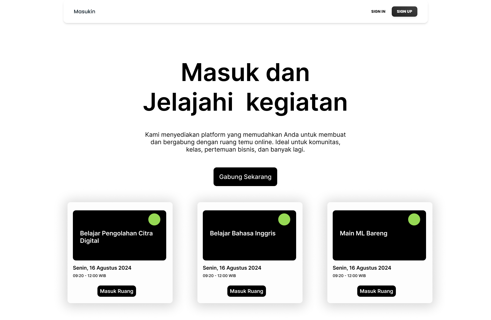

# Masukin-Event Platform

Masukin-Event Platform adalah sebuah aplikasi web yang memfasilitasi pengguna untuk bergabung dan berbagi ruang temu online dengan mudah. Platform ini dikembangkan menggunakan teknologi MERN (MongoDB, Express.js, React.js, Node.js), yang merupakan stack teknologi populer untuk pengembangan aplikasi web modern.

## Fitur Utama

1. **Pembuatan Acara**: Pengguna dapat membuat acara baru dengan mengisi detail seperti judul, deskripsi, tanggal, waktu, dan lokasi (jika ada).

2. **Bergabung dengan Acara**: Pengguna dapat melihat daftar acara yang sedang berlangsung atau akan datang dan bergabung dengan acara yang diminati.

3. **Ruang Temu Online**: Setelah bergabung dengan acara, pengguna akan diarahkan ke ruang temu online yang terintegrasi dengan platform video konferensi seperti Zoom, Google Meet, atau solusi lainnya.

4. **Penjadwalan Acara**: Pengguna dapat menjadwalkan acara di masa mendatang dan mengatur pengingat agar tidak melewatkan acara penting.

5. **Diskusi dan Obrolan**: Platform menyediakan fitur diskusi dan obrolan terkait acara, di mana pengguna dapat berinteraksi, berbagi ide, dan berkolaborasi dengan peserta lain.

6. **Profil Pengguna**: Pengguna dapat membuat profil pribadi dengan informasi biografis, minat, dan preferensi acara untuk memudahkan identifikasi dan jaringan dengan pengguna lain.

7. **Pencarian dan Filter Acara**: Pengguna dapat mencari dan memfilter acara berdasarkan kategori, lokasi, tanggal, atau kata kunci tertentu untuk menemukan acara yang sesuai dengan minat mereka.

## Teknologi yang Digunakan

- **MongoDB**: Database NoSQL untuk menyimpan data acara, pengguna, dan informasi terkait.
- **Express.js**: Framework web untuk Node.js yang digunakan untuk membangun API back-end.
- **React.js**: Perpustakaan JavaScript untuk membangun antarmuka pengguna yang interaktif dan responsif di sisi front-end.
- **Node.js**: Lingkungan runtime JavaScript yang digunakan untuk menjalankan server back-end dan menangani permintaan HTTP.
- **Socket.IO**: Perpustakaan untuk komunikasi real-time antara server dan klien, digunakan untuk fitur obrolan dan diskusi.
- **Integrasi Video Konferensi**: Platform ini akan terintegrasi dengan solusi video konferensi seperti Zoom, Google Meet, atau solusi lainnya untuk menyediakan ruang temu online.

## Kontribusi

Kami terbuka untuk kontribusi dari komunitas pengembang.
